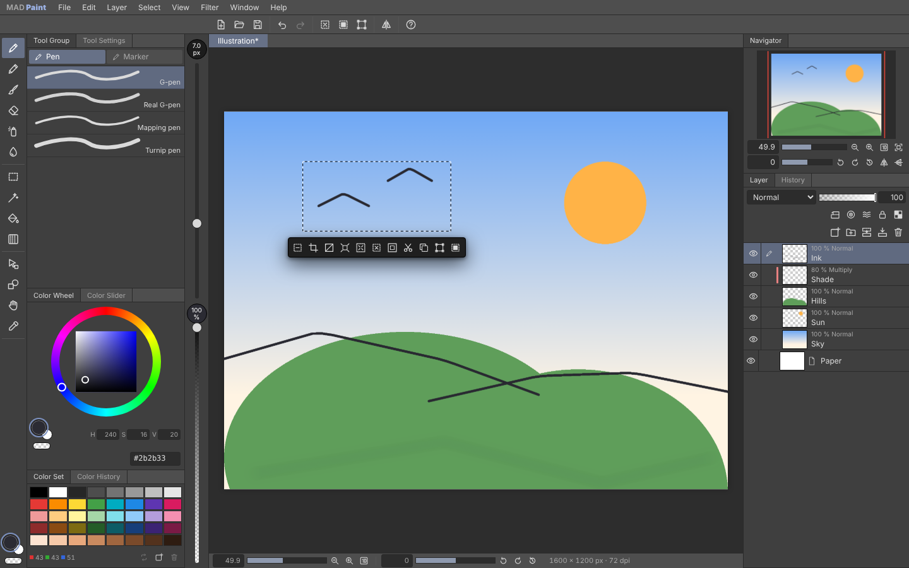
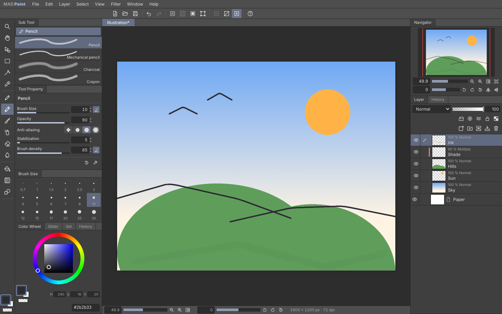

# MAD Studio Paint

> **Vorbild:** Clip Studio Paint (Celsys, <https://www.clipstudio.net/>) · **Plattform:** macOS (Electron-App) und Browser ·
> **Status:** 🟢 v0.1 lauffähig

[](https://github.com/MADTreasures/reverse/actions/workflows/mad-studio-paint-ci.yml)
[](https://github.com/MADTreasures/reverse/actions/workflows/mad-studio-paint-macos.yml)

MAD Studio Paint ist ein **ebenenbasiertes Mal- und Zeichenprogramm** für Illustration und
Comic. Es ist so gebaut, dass sich Leute, die Clip Studio Paint kennen, sofort zurechtfinden:
gleiche Anordnung der Paletten, gleiche Werkzeuggruppen und Untertools, gleiche
Zusatztasten (Space = Hand, ⌥-Klick = Pipette, ⇧ = gerade Linie …) und dieselben Abläufe bei
Ebenen, Auswahl und Füllen. Alles ist selbst geschrieben – Code, Pinsel-Engine, Icons und
App-Symbol. Wie das Vorbild untersucht und verglichen wurde, steht in
[RESEARCH.md](RESEARCH.md).




## Funktionen

| Bereich | Was geht |
| ------- | -------- |
| **Zeichnen** | Pen (G-pen, Real G-pen, Mapping pen, Turnip pen, Calligraphy · Milli pen, Felt pen, Dot pen), Pencil (Pencil, Mechanical pencil, Charcoal, Crayon), Brush (Round watercolor brush, Transparent watercolor, Opaque watercolor, Brush pen, Dry ink · Oil paint, Flat brush, Gouache, Soft brush), Airbrush (Soft, Spray, Droplet), Eraser (Hard, Soft, Kneaded eraser, Rough), Blend (Blend, Blur, Finger tip) |
| **Pinsel-Engine** | Stiftdruck auf Grösse und Dichte mit **Druckkurve** je Einstellung und **globaler Druckeinstellung** (*File → Pen pressure settings*: Kurve, Stärker/Leichter, Testfeld, automatisch aus dem Gezeichneten), **Stiftneigung** (breiter/heller wie die Bleistiftseite), Zufall, Stabilisierung 0–100, Kantenglättung in 4 Stufen, Deckkraft pro Strich und „Brush density“ pro Tupfer, **Pinselspitze** (Härte, Dicke, Winkel – fest, Linienrichtung oder Stiftrichtung), **Ein- und Auslaufen** (auch mit der Maus), **Farbmischung** (Blend, Running color: Farbmenge, Farbdichte, Farbdehnung), **Aquarellkante**, Abstand, Körnung, Streuung – alles im Fenster *Advanced Tool Settings* (Schraubenschlüssel) |
| **Werkzeuge** | Auswahlbereich (Rechteck, Ellipse, Lasso, Polylinie, Auswahlstift, Auswahl radieren), Auto select (Bearbeitungsebene / alle Ebenen / Referenzebenen), Füllen (Toleranz, **Lücke schliessen** in 5 Stufen, Bereichsvergrösserung, Mehrfachreferenz, nur verbundene Pixel), **Verlauf** (Knotenleiste mit Haupt-/Unter-/Wunschfarbe und Deckkraft, Umkehren, *Verlauf bearbeiten* mit Verlaufsliste: eigene Vorlagen und eigener Verlaufssatz zum Laden, Ersetzen, Duplizieren, Anlegen, Löschen; Form Linie/Kreis/Ellipse; Randverhalten nicht wiederholen / wiederholen / spiegeln / nicht zeichnen; Dithering; **Verlaufsebenen**, deren Richtung, Farben und Form später änderbar sind – mit dem Verlaufswerkzeug neu ziehen oder Start-/Endgriff mit dem Objekt-Werkzeug; *Layer → New gradient layer*), Figur (Gerade, Rechteck, Ellipse), **Lineale** (Lineal, Hilfslinie, Spezial-Lineale: parallel, radial, konzentrisch, **Symmetrie-Lineal** mit 2–32 Linien und Spiegelung, **Perspektiv-Lineal** mit 1–3 Fluchtpunkten; Striche und Figur-Linien rasten ein, *Snap to ruler* ⌘1 / *Snap to special ruler* ⌘2, Geltungsbereich je Ebene), Operation (Objekt: **Vektorlinien** wählen (⇧ ergänzt), verschieben, skalieren, drehen, Farbe/Breite/Deckkraft ändern, löschen; Lineale wählen/verschieben/bearbeiten/löschen; Ebene wählen, Ebene verschieben), Pipette (angezeigte Farbe / Ebenenfarbe), Hand, Drehen, Zoom |
| **Ebenen** | Rasterebenen, **Vektorebenen** und Ordner (Normal oder „Through“), **alle 28 Ebenenmodi** des Vorbilds (11 davon pixelweise berechnet), Deckkraft, **Ebeneneigenschaften** (Randeffekt: Kante oder Aquarellkante, **Rasterfolie/Ton**: Rasterweite in lpi, Dichte aus Farbe/Helligkeit/fester Wert, Deckkraft als Punktgrösse, Posterisierung, Punktformen Kreis/Quadrat/Raute/Linie/Kreuz/Ellipse/Rauschen, Winkel, Position; Ebenenfarbe mit Unterfarbe), **Rasterfolien-Ebenen** (*Layer → New tone layer* / Auswahl-Starter „New tone“: Dichte, Typ, Winkel, Maske aus der Auswahl, benannt wie „Circle 60.0 line 10%“), **Korrekturebenen** (die neun Tonwertkorrekturen als Ebene, mit eigener Maske, beschneidbar, Einstellungen per Klick aufs Symbol), **Ebenenmasken** (Ausserhalb der Auswahl / Auswahl maskieren, auf der Maske zeichnen: Farbe zeigt, Radierer verbirgt, Löschen = nichts maskiert, aktivieren, Maskenbereich anzeigen, mit der Ebene verknüpfen, auf die Ebene anwenden, ⌘-Klick = Auswahl), Auf untere Ebene beschneiden, Referenz-, Entwurfsebene, Sperren, Transparente Pixel schützen, Auf untere Ebene übertragen, Mit unterer / sichtbare Ebenen vereinen, Auf eine Ebene reduzieren, Ordner erstellen/auflösen, Duplizieren (auch ⌥-Ziehen), ⌥-Klick aufs Auge = nur diese Ebene, ⌘-Klick aufs Miniaturbild = Auswahl, Papier-Ebene (wie im Vorbild Teil des Stapels: Ebenenmodi und Korrekturebenen wirken auf sie) |
| **Text & Sprechblasen** | **Text-Werkzeug** (T): klicken und tippen oder einen Rahmen aufziehen (Umbruch am Rahmen, Überstehendes verborgen), direkt auf der Leinwand mit Zoom und Drehung (auch Eingabemethoden für Japanisch usw.), Text-Starter mit OK/Abbrechen, ⌘Enter bestätigt, Esc bricht ab; Text anklicken = bearbeiten. Schrift (beliebige installierte), Grösse in pt, fett/kursiv/unterstrichen/durchgestrichen, Ausrichtung, **vertikaler Text** (Spalten von rechts nach links, lateinische Zeichen gedreht), Zeilen- und Zeichenabstand, Textrand. Textebenen heissen nach ihrem Text. **Sprechblasen** (T): Ellipse, abgerundet, Rechteck, Gedankenblase (Wolke); Linie in Haupt-, Füllung in Unterfarbe; **Sprechblasenschwanz** (gebogen) und Gedankenschwanz (Bläschen) von innen nach aussen ziehen; Blasen über Text nehmen ihn auf und zentrieren ihn, überlappende Blasen verschmelzen. Objekt-Werkzeug: Text/Blasen wählen, verschieben (Text in der Blase geht mit), skalieren, drehen, Doppelklick = Text bearbeiten, Linien- und Füllfarbe |
| **Comic-Rahmen** | **Rahmenordner** (*Layer → New frame border folder*: ein Rahmen innerhalb der Seitenränder, Linienbreite, „Draw border“): der Inhalt des Ordners ist nur im Rahmen sichtbar, die Rahmenlinie liegt darüber. Werkzeug **Frame border** (U): Rechteckrahmen (rastet an Leinwand und anderen Rahmen ein), Polylinienrahmen, **Rahmen teilen** (über einen Rahmen ziehen, Stege oben/unten und links/rechts in mm, neuer Rahmenordner je Teil), *Layer → Ruler/Frame → Divide frame border equally* (Spalten × Zeilen). Objekt-Werkzeug: Rahmen an der Linie greifen, verschieben, skalieren, drehen, Linienbreite/-farbe, Entf löscht den Rahmen (der Ordner bleibt). Rahmenkanten wirken als Lineal (⌘1) |
| **Animation** | *File → New* mit „Create animated illustration“ (Anzahl Zellen, Bildrate) oder *Animation → New animation layer → Animation folder*: **Animationsordner** (A, B, C …) mit nummerierten **Zellen** (1, 2, 3 …; eine Zelle kann auch ein Ordner mit mehreren Ebenen sein). **Zeitleisten-Palette** unter der Leinwand: eine Spur je Animationsordner, Bildleiste zum Anklicken und Ziehen (Scrubben), Zelle auf einen Frame legen per Rechts- oder Doppelklick (Zelle, leer, löschen, neue Zelle), eine Zelle gilt bis zur nächsten Zuweisung. Neue Animationszelle (auf dem gewählten Frame bzw. dem nächsten), Zugewiesene Zelle löschen, Vorige/nächste Zelle, Frame einfügen/löschen, Bildrate und Länge (*Timeline → Change settings*), Zeitleiste ein/aus. **Abspielen** mit Bildrate, Schleife, Esc stoppt. **Zwiebelschicht** (vorige/nächste Zellen, Anzahl, Farbe/Halbfarbe/Monochrom, Anzeigefarben, Deckkraft und Abstufung). Wer eine Zelle wählt, springt zu einem Frame, der sie zeigt; Zellen anderer Frames sind gesperrt. *File → Export animation*: **animiertes GIF** (Grösse, Bereich, Bildrate, Wiederholungen, Dithering, Transparenz), **APNG**, **Einzelbildfolge** (PNG/JPEG mit Präfix und Startnummer, als ZIP) |
| **Vektorebenen** | Jeder Strich (Pinsel, Figur, auch mit Symmetrie) wird als Linie mit Breite und Dichte je Punkt gespeichert und daraus gezeichnet: Verschieben, ⌘T, Spiegeln, Bildauflösung und Leinwandgrösse verlieren nichts. **Vektorradierer** (berührten Bereich, **bis zum Schnittpunkt** – auf Wunsch mit allen Ebenen –, ganze Linie), normale Radierer radieren den berührten Teil, Transparentfarbe zeichnet radierende Linien; *Select → Select overlapping vectors / Select vectors within area*; Füllen, Verlauf und Mischen sind wie im Vorbild gesperrt; *Layer → Rasterize*; Vektorebenen lassen sich in Vektorebenen vereinen |
| **Auswahl** | Hinzufügen (⇧) / Abziehen (⌥) / Schnittmenge (⇧⌥), Quadrat/Kreis (⇧ beim Aufziehen), Alles, Aufheben, Erneut, Umkehren, Vergrössern/Verkleinern, laufende Ameisen und **Auswahl-Starter** (Aufheben, Zuschneiden, Umkehren, Vergrössern, Verkleinern, Löschen, Ausserhalb löschen, Ausschneiden/Kopieren & Einfügen, Transformieren, Füllen) |
| **Bearbeiten** | Undo/Redo (200 Schritte, History-Palette), Ausschneiden/Kopieren/Einfügen (auch Bilder aus der Zwischenablage), Löschen, Füllen, Skalieren/Drehen (⌘T) und Freies Transformieren (⇧⌘T), Spiegeln, **Tonwertkorrektur** mit Vorschau – alle neun des Vorbilds: Helligkeit/Kontrast, Tonwertkorrektur mit Histogramm, Gradationskurve, Farbton/Sättigung/Helligkeit (⌘U), Farbbalance, Umkehren (⌘I), Posterisieren, Binarisieren, Verlaufsumsetzung, Gaussian blur, Bildauflösung, Leinwandgrösse |
| **Ansicht** | Zoom 0,78 %–3200 % in den Stufen des Vorbilds (Mausrad, Pinch, ⌘+/⌘−), Drehen in 5°-Schritten um die Fenstermitte, Ansicht spiegeln, Navigator, Zoom/Drehung in der Statusleiste, Tab / ⇧Tab blendet Paletten / Menüleiste aus |
| **Farbe** | Farbkreis (Farbtonring + Sättigung/Helligkeit, H/S/V-Werte), RGB-Regler, Farbset, Farbverlauf, Haupt-/Unter-/Transparentfarbe |
| **Arbeitsbereich** | **Standard** (Layout der aktuellen Version: Tool Group/Tool Settings, Tool Sliders) und **Klassisch** (Sub Tool, Tool Property, Brush Size untereinander) – *Window → Workspace*; Einstellungen (⌘K): dunkles/helles Design, Drehschritt, Anzahl Undo, Haltezeit der Werkzeugtasten |
| **Dateien** | Eigenes Format `.madpaint` (ZIP mit `document.json` und einer PNG-Datei pro Ebene), **Photoshop-Dokumente** (`.psd`/`.psb` öffnen mit Ordnern, Masken, Schnittmasken, Modi, Deckkraft, Sperren und Einstellungsebenen; *File → Save duplicate → .psd* mit Ebenen, Papier als unterste Ebene „Paper“, Entwurfsebenen wahlweise; *Export (single layer)* als PSD, auf Wunsch als Hintergrund), PNG/JPEG/WebP öffnen und exportieren (Skalierung, ohne Entwurfsebenen, transparent oder auf Papier), Bilder ablegen (auf der Leinwand: öffnen, auf der Ebenen-Palette: als Ebene), Autosave & Wiederherstellung |

## Installation auf dem Mac

### Variante A – fertige App herunterladen

1. Auf GitHub unter **Actions → „MAD Studio Paint · macOS app“** den neuesten erfolgreichen Lauf
   öffnen (oder unter **Releases**, sobald ein Tag `mad-studio-paint-v*` existiert).
2. Unten bei *Artifacts* **`MAD-Studio-Paint-macOS-Apple-Silicon`** (M1–M4) oder
   **`MAD-Studio-Paint-macOS-Intel`** herunterladen und entpacken – darin liegt die DMG-Datei.
3. DMG öffnen und **MAD Studio Paint** in den Programme-Ordner ziehen.
4. Die App ist nicht von Apple notarisiert. Beim ersten Start blockiert macOS sie deshalb.
   Abhilfe: *Systemeinstellungen → Datenschutz & Sicherheit → „Trotzdem öffnen“*, oder im Terminal:

   ```bash
   xattr -dr com.apple.quarantine "/Applications/MAD Studio Paint.app"
   ```

### Variante B – selbst bauen

Voraussetzung: [Node.js](https://nodejs.org/) 22.12 oder neuer.

```bash
cd projects/mad-studio-paint
npm ci
npm run dist:mac        # erzeugt release/MAD-Studio-Paint-0.1.0-arm64.dmg und …-x64.dmg
```

Zum schnellen Ausprobieren ohne Paketieren: `npm run app` (baut und startet die App).

### Variante C – im Browser

```bash
cd projects/mad-studio-paint
npm ci
npm run dev             # http://localhost:5174 in Chrome, Edge oder Safari öffnen
```

Grafiktabletts funktionieren in beiden Varianten mit Druckempfindlichkeit (Pointer Events).

## Für Umsteiger von Clip Studio Paint

Die Bedienung folgt dem öffentlichen Handbuch des Vorbilds (Ver. 5). Die wichtigsten Gewohnheiten:

| Gewohnheit | In MAD Studio Paint |
| ---------- | ------------------- |
| Werkzeugtasten mehrfach drücken wechselt innerhalb der Gruppe (P = Feder ↔ Bleistift, B = Pinsel ↔ Airbrush, G = Füllen ↔ Verlauf) | gleich |
| Werkzeugtaste **gedrückt halten** = Werkzeug nur vorübergehend, beim Loslassen zurück | gleich |
| Space = Hand, ⇧Space = Drehen, ⌘Space = Zoom +, ⌥Space = Zoom − | gleich |
| ⌥-Klick mit Zeichenwerkzeugen = Pipette, ⌘⌥-Ziehen = Pinselgrösse, ⇧-Ziehen = gerade Linie | gleich |
| X = Haupt-/Unterfarbe tauschen, C = Transparentfarbe, [ / ] = Pinselgrösse | gleich |
| ⌘⇧-Klick = Ebene unter dem Mauszeiger wählen | gleich |
| Tab = Paletten ausblenden, ⇧Tab = Menüleiste ausblenden | gleich |
| Ebenen-Palette: Modus + Deckkraft oben, Schalter für Schnittmaske/Referenz/Entwurf/Sperren, Stift-Symbol markiert die Bearbeitungsebene | gleich |
| Vektorebenen: Vektorradierer, Objekt-Werkzeug | gleich (Linienkorrektur-Werkzeuge noch nicht) |
| Text-Werkzeug und Sprechblasen (T) | gleich (ohne Rubi, Kreistext, Zeichenformat pro Buchstabe) |
| Comic-Rahmen (Rahmenordner, Rahmen teilen) | gleich (ohne Vorlagen, Kontrollpunkte, Rahmen verbinden) |
| Animation: Animationsordner, Zeitleiste, Zwiebelschicht, GIF-Export | gleich (ohne Keyframes, Kamera, Clips, Leuchttisch, Ton, Film-Export) |
| 3D | noch nicht (siehe unten) |

### Tastenkürzel

Wie im Handbuch des Vorbilds (macOS: Ctrl → ⌘, Alt → ⌥):

| Taste | Funktion | Taste | Funktion |
| ----- | -------- | ----- | -------- |
| P | Pen / Pencil | M | Auswahlbereich |
| B | Brush / Airbrush | W | Auto select |
| E | Eraser | I | Pipette |
| J | Blend | K / D | Ebene verschieben / Ebene wählen |
| G | Füllen / Verlauf | H / R / `/` | Hand / Drehen / Zoom |
| U | Figur / Rahmen / Lineal | , / . | Voriges / nächstes Werkzeug der Gruppe |
| T | Text / Sprechblase | O | Objekt (auch ⌘ mit Zeichenwerkzeugen) |
| [ / ] | Pinselgrösse (Voreinstellungen) | ⌘[ / ⌘] | Deckkraft − / + |
| X / C | Farben tauschen / Transparentfarbe | ⇧⌘O / ⇧⌘P | Dichte − / + |
| ⌘N / ⌘O / ⌘S / ⇧⌘S | Neu / Öffnen / Speichern / Speichern unter | 0 | Mehrfachreferenz (Füllen) |
| ⌘Z / ⌘Y (⇧⌘Z) | Undo / Redo | ⌘T / ⇧⌘T | Skalieren/Drehen / Freies Transformieren |
| ⌘X ⌘C ⌘V (F2 F3 F4) | Ausschneiden / Kopieren / Einfügen | ⌫ / ⇧⌫ / ⌥⌫ | Löschen / Ausserhalb löschen / Füllen |
| ⌘A / ⌘D / ⇧⌘D / ⇧⌘I | Alles / Aufheben / Erneut / Umkehren | ⌘U / ⌘I | Farbton·Sättigung·Helligkeit / Umkehren |
| ⇧⌘N | Neue Rasterebene | ⌘E / ⇧⌘E | Mit unterer / sichtbare Ebenen vereinen |
| ⌘G / ⇧⌘G | Ordner erstellen / auflösen | ⌥⌘G | Auf untere Ebene beschneiden |
| ⌥] / ⌥[ | Ebene darüber / darunter wählen | ⌘K | Einstellungen |
| ⌘+ / ⌘− / ⌘0 / ⌥⌘0 | Zoom + / − / Einpassen / 100 % | − / = (^) | Ansicht links / rechts drehen (5°) |
| Tab / ⇧Tab | Paletten / Menüleiste aus | F1 | Alle Tastenkürzel |

## Dokumente

- `.madpaint` ist ein ZIP-Archiv mit `document.json` (Ebenenbaum, Modi, Deckkraft, Flags,
  Papierfarbe, Vektorlinien, Text und Sprechblasen, Zeitleiste und Zellen-Zuweisungen – lesbares JSON) und `layers/<id>.png` (eine verlustfreie PNG-Datei
  pro Rasterebene und pro Ebenenmaske, die Maske im Alphakanal) sowie `preview.png`. Fremde
  Programme können die Ebenen so direkt öffnen. Vektorebenen speichern ihre Linien (Punkte mit
  Breite und Dichte, eine Pinseltabelle je Ebene), Textebenen ihre Textrahmen und Sprechblasen;
  beide werden beim Öffnen neu gezeichnet.
- Das Clip-Studio-Format `.clip` wird **nicht** gelesen oder geschrieben (siehe
  [RESEARCH.md](RESEARCH.md)). Austausch mit anderen Programmen: **PSD** sowie PNG/JPEG/WebP.
- **PSD** (über die MIT-lizenzierte Bibliothek [ag-psd](https://github.com/Agamnentzar/ag-psd);
  der Code dafür lädt erst, wenn eine PSD geöffnet oder gespeichert wird):
  - *File → Open* liest `.psd` und `.psb` (RGB, CMYK, Graustufen; 8, 16 und 32 Bit) mit
    Ordnern („Hindurchwirken“ bleibt erhalten), Ebenenmasken, Schnittmasken, allen passenden
    Ebenenmodi, Deckkraft (auch „Fläche“), Sichtbarkeit und Sperren. Einstellungsebenen werden zu
    Korrekturebenen: Helligkeit/Kontrast, Tonwertkorrektur, Gradationskurve,
    Farbton/Sättigung, Farbbalance, Umkehren, Tontrennung, Schwellenwert, Verlaufsumsetzung.
    Text-, Form- und Smartobjekt-Ebenen kommen als Pixel; Ebenenstile entfallen (ein Hinweis
    nennt, was nicht übernommen wurde). Eine unterste Ebene „Paper“ wird wieder zum Papier.
    Gespeichert wird danach als `.madpaint`; die PSD bleibt unverändert.
  - *File → Save duplicate → .psd* schreibt die Ebenen wie das Vorbild: Vektor-, Text- und
    Verlaufsebenen als Pixel, das Papier als unterste Ebene „Paper“, Entwurfsebenen nur wenn
    angehakt. Korrekturebenen werden zu Einstellungsebenen. Rahmenordner werden Gruppen mit
    einer Maske in Form der Rahmen und der Rahmenlinie als Ebene. Ebenen mit Randeffekt,
    Ebenenfarbe oder Rasterfolie werden so geschrieben, wie sie aussehen (Photoshop kennt diese
    Effekte nicht). Ein zusammengesetztes Bild liegt bei, damit Vorschau und Quick Look es zeigen.
  - *File → Export (single layer)* bietet PSD als Format, auf Wunsch „Output as background“.
- Die Arbeit wird einige Sekunden nach jeder Änderung automatisch gesichert (IndexedDB)
  und beim nächsten Start wiederhergestellt. Das ersetzt kein Speichern in eine Datei.

## Architektur

```
src/
├── model/        Dokumentmodell (Ebenenbaum, Modi, Flags), Farben, Clipping-Gruppen – reine Logik
├── paint/        Pinsel-Mathematik (Dabs, Druck, Stabilisierung), Füllen, Auswahlmasken, Undo-Stapel,
│                 Werkzeuge & Untertools, Ansichts-Transformation – reine Logik, unit-getestet
├── engine/       Pixel-Seite: eine Canvas pro Ebene und Maske, Compositor (Modi, Ordner, Masken,
│                 Schnittmasken, nur geänderte Bereiche), Pinsel-Engine, Bearbeitungen mit Undo-Patches
├── tools/        Zeiger-Eingabe → Werkzeug: Zusatztasten, Sitzungen je Werkzeug, Freies Transformieren
├── store/        Zustand (zustand), Aktionen (Ebenen, Auswahl, Undo/Redo, Ansicht), Zwischenablage
├── io/           .madpaint-Format, PSD (ag-psd, nachgeladen), Öffnen/Speichern/Export, Autosave
├── ui/           React-Oberfläche: Paletten, Zeichenfläche, Menüs (eine Befehlstabelle für die
│                 Menüleiste im Browser und das native Mac-Menü), Dialoge, Tastatur
└── platform/     Brücke zu Electron (Dateidialoge, Menü) bzw. Browser-Fallbacks
electron/         Electron-Hauptprozess (app://-Protokoll, natives Menü, Dateidialoge) und Preload
tests/e2e/        Playwright-Tests der laufenden App
```

Ein Pinselstrich wird in einen Strich-Puffer gezeichnet und bei jedem Mausereignis nur im
geänderten Rechteck mit der Ebene verrechnet (Sicherung ⊕ Puffer, maskiert durch die Auswahl,
„Transparente Pixel schützen“ über `source-atop`). So bleibt die Deckkraft innerhalb eines
Strichs konstant, und Vorschauen (gerade Linie, Figur, Verlauf) lassen sich beliebig neu
zeichnen. Undo speichert nur die Pixel des geänderten Rechtecks (vorher/nachher).

## Entwicklung

```bash
npm run dev          # Browser-Version mit Hot Reload
npm run app:dev      # Electron-Fenster mit Hot Reload
npm run typecheck    # TypeScript prüfen
npm test             # Unit-Tests (Vitest)
npm run test:e2e     # End-to-End-Tests der laufenden App (Playwright, Chromium)
npm run check        # Typecheck + Unit-Tests + Build
npm run dist:mac     # macOS-App als DMG (arm64 + x64) nach release/
npm run icon         # App-Icon aus build/icon.svg neu erzeugen
```

CI: [`mad-studio-paint-ci.yml`](../../.github/workflows/mad-studio-paint-ci.yml) prüft jede
Änderung unter Linux (Typecheck, Tests, Build, E2E, Electron-Start).
[`mad-studio-paint-macos.yml`](../../.github/workflows/mad-studio-paint-macos.yml) baut die
Mac-App auf einem macOS-Runner, startet sie testweise und stellt die DMGs als Artefakte bereit.
Bei einem Tag `mad-studio-paint-v*` wird daraus ein GitHub-Release.

## Grenzen und nächste Schritte

Was im Vergleich zum Vorbild noch fehlt, steht Punkt für Punkt in
[RESEARCH.md](RESEARCH.md#vergleich-clip-studio-paint-laut-handbuch--mad-studio-paint). Die grössten Lücken:

- Linienkorrektur auf Vektorebenen (Kontrollpunkte, Linien ziehen/vereinfachen/verbinden),
  Kurven- und Figur-Lineale, Raster und 3D; bei der Animation Keyframes, 2D-Kamera, Clips,
  Leuchttisch, Ton, mehrere Zeitleisten und Film-Export (MP4/MOV); bei Rasterfolien die
  Bildmotiv-Punkte (Stern, Herz …), das Werkzeug „Rasterpunkte verschieben“ und „Tonbereich
  anzeigen“; beim
  Text: Formatierung einzelner Buchstaben, Rubi (Lesehilfe), Kreistext; bei Rahmen: Vorlagen,
  Rahmen verbinden, Kontrollpunkte, Comic-Seiten mit Beschnitt und Innenrand.
- Pinsel-Materialien (Bildspitzen, Texturen, Doppelpinsel), Tempo als Dynamik, Freiform-Verlauf.
- Import/Export von `.clip`. Beim PSD-Austausch: Text bleibt nicht editierbar, Ebenenstile
  und Vektormasken werden nicht als solche übernommen, „Glow dodge“ und „Add (Glow)“ werden zu
  „Farbig abwedeln“ bzw. „Linear abwedeln“.

## Rechtliches

MAD Studio Paint ist ein unabhängiges Projekt und steht in keiner Verbindung zu Celsys.
„Clip Studio Paint“ ist eine Marke von Celsys, Inc. und wird hier nur beschreibend als
Vorbild genannt. Es wurde kein Code, keine Grafik, kein Pinsel und keine Datei von Clip Studio
Paint verwendet. Das Programm wurde weder heruntergeladen noch installiert, dekompiliert oder
mit REA analysiert – das verbietet die Lizenzvereinbarung (§5.2/§5.3). Grundlage war die
öffentliche Dokumentation; Details in [RESEARCH.md](RESEARCH.md).

Mitgelieferte Open-Source-Bibliotheken (React, zustand, fflate, ag-psd mit pako und base64-js, gifenc)
stehen unter MIT- bzw. Zlib-Lizenz. Ihre Lizenztexte schreibt der Build nach
`dist/THIRD_PARTY_LICENSES.txt`, das mit der App ausgeliefert wird.
