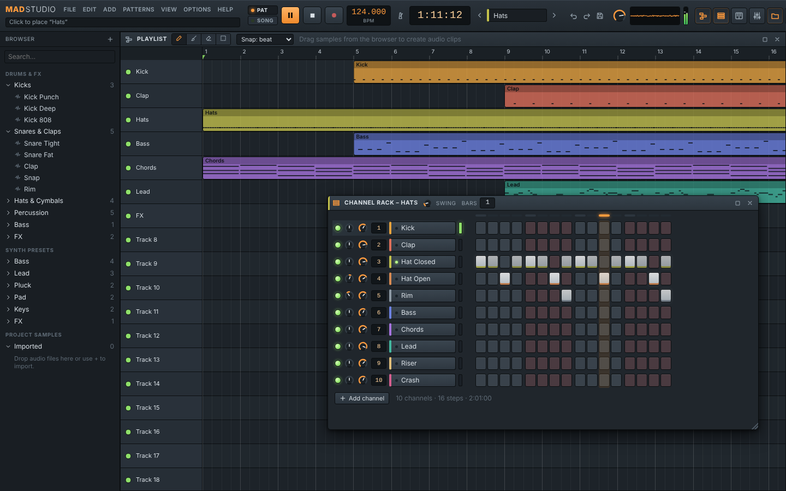
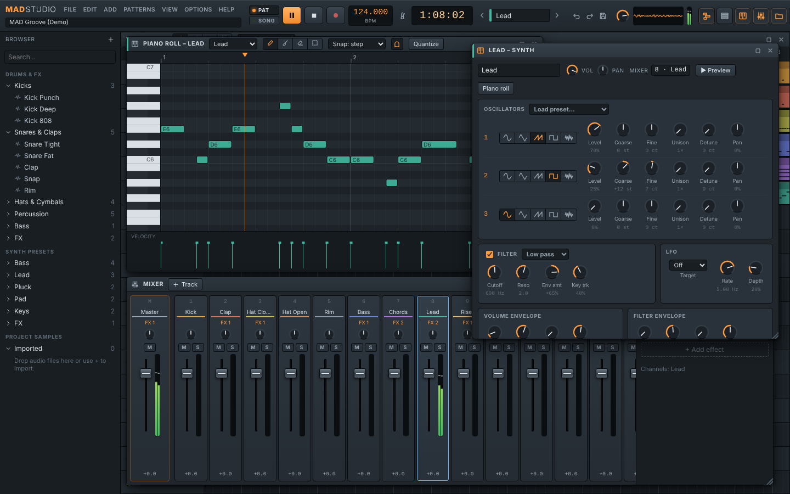

# MAD Studio

> **Vorbild:** FL Studio (Image-Line, <https://www.image-line.com/>) · **Plattform:** macOS (Electron-App) und Browser ·
> **Status:** 🟢 v0.1 lauffähig

[](https://github.com/MADTreasures/reverse/actions/workflows/mad-studio-ci.yml)
[](https://github.com/MADTreasures/reverse/actions/workflows/mad-studio-macos.yml)

MAD Studio ist eine **pattern-basierte Musikproduktions-Software (DAW)** mit dem Workflow,
den man von FL Studio kennt: Beats im **Channel Rack** per Step-Sequencer bauen, Melodien
in der **Piano Roll** schreiben, Patterns in der **Playlist** zu einem Song anordnen und
alles im **Mixer** mit Effekten abmischen. Alles ist selbst geschrieben – Code, Klänge und
Grafiken. Das mitgelieferte Drum-Kit wird beim Start synthetisiert, es sind keine fremden
Samples enthalten.




## Funktionen

| Bereich | Was geht |
| ------- | -------- |
| **Channel Rack** | Step-Sequencer (malen, Rechtsklick löscht, Mausrad = Velocity), Lautstärke/Pan, Mute/Solo, Mixer-Routing, Swing, Pattern-Länge, „Fill each 2/4/8 steps“, Mini-Piano-Roll-Vorschau |
| **Piano Roll** | Zeichnen, Malen, Verschieben, Länge ziehen, Rechteck-Auswahl, Velocity-Spur, Snap (inkl. Triolen), Ghost Notes, Quantisieren, Kopieren/Einfügen/Duplizieren, Transponieren, Vorhören über die Klaviatur |
| **Playlist** | Patterns platzieren, verschieben, Länge ändern (Pattern läuft in Schleife), links trimmen, Shift+Ziehen dupliziert, Audio-Clips aus Samples (mit Wellenform), Spuren muten/umbenennen, Song-Position per Klick ins Lineal |
| **Mixer** | Master + 16 Insert-Spuren (erweiterbar bis 64), Fader, Pan, Mute/Solo, Stereo-Pegelanzeigen, bis zu 8 Effekte pro Spur |
| **Effekte** | Parametric EQ, Auto Filter (mit LFO), Compressor, Distortion, Chorus, Tempo Delay (Ping-Pong, tempo-synchron), Reverb, Limiter |
| **Instrumente** | 3-Oszillator-Synth (Sinus/Dreieck/Säge/Rechteck/Rauschen, Unison, Filter mit Hüllkurve, LFO) mit 14 Presets · Sampler (Root-Key, Feinstimmung, Reverse, One-Shot, Loop, Choke-Gruppen, ADSR) |
| **Sounds** | 20 synthetisierte Factory-Sounds: Kicks, Snares, Claps, Hi-Hats, Becken, Toms, Percussion, 808-Bass, Riser, Impact |
| **Transport** | Pattern-/Song-Modus, Tempo (10–522 BPM), Metronom, Aufnahme von Tastatur/MIDI ins Pattern, Positionsanzeige (Takt:Step:Tick oder Zeit) |
| **Eingabe** | Computertastatur als Klavier (funktioniert auch mit Schweizer/Deutscher QWERTZ-Tastatur), MIDI-Keyboards (Web MIDI) |
| **Dateien** | Projekte als `.madstudio` (ZIP mit `project.json` und allen eigenen Samples), Autosave & Wiederherstellung, Audio-Import per Drag & Drop (WAV, AIFF, MP3, …), **WAV-Export** (16/24-bit, 32-bit float, 44.1–96 kHz) |
| **Komfort** | Undo/Redo, frei verschiebbare Fenster wie im Vorbild, Hinweisleiste für jedes Bedienelement, Demo-Song „MAD Groove“ |

## Installation auf dem Mac

### Variante A – fertige App herunterladen

1. Auf GitHub unter **Actions → „MAD Studio · macOS app“** den neuesten erfolgreichen Lauf öffnen
   (oder unter **Releases**, sobald ein Tag `mad-studio-v*` existiert).
2. Artefakt **`MAD-Studio-macOS`** herunterladen und entpacken. Darin liegen DMG und ZIP für
   Apple Silicon (`arm64`) und Intel (`x64`).
3. DMG öffnen und **MAD Studio** in den Programme-Ordner ziehen.
4. Die App ist nicht von Apple notarisiert. Beim ersten Start blockiert macOS sie deshalb.
   Abhilfe: *Systemeinstellungen → Datenschutz & Sicherheit → „Trotzdem öffnen“*, oder im Terminal:

   ```bash
   xattr -dr com.apple.quarantine "/Applications/MAD Studio.app"
   ```

### Variante B – selbst bauen (empfohlen für Entwickler)

Voraussetzung: [Node.js](https://nodejs.org/) 22.12 oder neuer.

```bash
cd projects/mad-studio
npm ci
npm run dist:mac        # erzeugt release/MAD Studio-0.1.0-arm64.dmg (und x64)
```

Selbst gebaute Apps sind nicht unter Quarantäne und starten direkt. Zum schnellen
Ausprobieren ohne Paketieren: `npm run app` (baut und startet die App).

### Variante C – im Browser

```bash
cd projects/mad-studio
npm ci
npm run dev             # http://localhost:5173 in Chrome, Edge oder Safari öffnen
```

MIDI-Keyboards funktionieren nur in Chromium-Browsern und in der Mac-App.

## Kurzanleitung

1. **Beat bauen:** Im Channel Rack auf die Step-Felder klicken (oder mit gedrückter Maus malen).
   Mit **Space** abspielen.
2. **Melodie schreiben:** Kanal anklicken → **F7** öffnet die Piano Roll. Klicken setzt Noten,
   Rechtsklick löscht, am rechten Notenrand zieht man die Länge.
3. **Patterns verwalten:** Oben im Pattern-Wähler (oder **[ / ]**) zwischen Patterns wechseln,
   über *Patterns → New pattern* neue anlegen.
4. **Song anordnen:** In der Playlist (**F5**) klicken platziert das aktuelle Pattern. Mit **L** in
   den Song-Modus wechseln und abspielen.
5. **Abmischen:** **F9** öffnet den Mixer. Kanäle werden über die Nummer im Channel Rack auf
   Mixer-Spuren geroutet. Effekte über *+ Add effect* hinzufügen.
6. **Exportieren:** *File → Export WAV…* (**⌘R**).

Eigene Samples einfach aus dem Finder in das Channel Rack (neuer Kanal), auf einen Kanal
(Sample ersetzen) oder in die Playlist (Audio-Clip) ziehen.

### Tastenkürzel

| Taste | Funktion | Taste | Funktion |
| ----- | -------- | ----- | -------- |
| Space | Play / Pause | F5 / F6 / F7 / F9 | Playlist / Channel Rack / Piano Roll / Mixer |
| L | Pattern-/Song-Modus | F8 | Browser ein/aus |
| R | Aufnahme | M | Metronom |
| [ / ] | Vorheriges / nächstes Pattern | ⌘T | Computertastatur als Klavier |
| ⌘Z / ⇧⌘Z | Undo / Redo | ⌘S / ⇧⌘S | Speichern / Speichern unter |
| ⌘O / ⌘N | Öffnen / Neues Projekt | ⌘R | WAV exportieren |
| ⌘A / ⌘C / ⌘V / ⌘B | Alles wählen / Kopieren / Einfügen / Duplizieren | Entf | Auswahl löschen |
| ↑ ↓ (⇧ = Oktave) | Noten transponieren | Q | Quantisieren |
| ⌘ + Mausrad / Pinch | Horizontal zoomen | ⌥ + Mausrad | Vertikal zoomen |

Die vollständige Liste zeigt **F1** in der App.

## Projektdateien

- `.madstudio` ist ein ZIP-Archiv mit `project.json` (lesbares JSON) und dem Ordner
  `samples/` mit allen importierten Audiodateien im Originalformat. Ein Projekt lässt sich so
  ohne fehlende Samples weitergeben.
- Die Sitzung wird alle paar Sekunden automatisch gesichert (IndexedDB) und beim nächsten
  Start wiederhergestellt. Das ersetzt aber kein Speichern in eine Datei.

## Architektur

```
src/
├── model/        Datenmodell (Projekt, Kanäle, Patterns, Noten, Clips, Mixer), Timing (96 PPQ),
│                 Timeline-Berechnung, Presets, Demo-Song, Dateiformat – reine Logik, ohne DOM
├── store/        Zustand (zustand + immer) mit Undo/Redo; alle Bearbeitungen laufen über actions.ts
├── audio/        Engine: Look-ahead-Scheduler, Synth, Sampler, Mixer-Graph, Effekte,
│                 Offline-Rendering, WAV-Encoder, synthetisierte Drum-Sounds
├── ui/           React-Oberfläche; Piano Roll und Playlist zeichnen auf <canvas>
├── project/      Öffnen/Speichern/Import/Export, Autosave
└── platform/     Brücke zu Electron (Dateidialoge, Menü) bzw. Browser-Fallbacks
electron/         Electron-Hauptprozess (app://-Protokoll, Menü, Dateidialoge) und Preload
tests/e2e/        Playwright-Tests der laufenden App
```

Datenfluss: Jede Bearbeitung erzeugt über `edit()` einen neuen, unveränderlichen
Projektzustand (für Undo). Die Audio-Engine abonniert den Store und gleicht ihren Web-Audio-
Graphen ab: Kanal → Instrument → Kanal-Strip → Mixer-Insert → Effekte → Master. Der Scheduler
plant Noten etwa 120 ms im Voraus auf die Sample-genaue Audio-Uhr (Look-ahead-Verfahren),
sodass Timing-Schwankungen der Oberfläche nicht hörbar sind. Dieselbe Graph-Klasse rendert
offline für den WAV-Export.

## Entwicklung

```bash
npm run dev          # Browser-Version mit Hot Reload
npm run app:dev      # Electron-Fenster mit Hot Reload
npm run typecheck    # TypeScript prüfen
npm test             # Unit-Tests (Vitest): Timing, Timeline, Scheduler, Store, Dateiformat, WAV, Sounds
npm run test:e2e     # End-to-End-Tests der laufenden App (Playwright, Chromium)
npm run check        # Typecheck + Unit-Tests + Build
npm run dist:mac     # macOS-App (DMG + ZIP, arm64 + x64) nach release/
npm run icon         # App-Icon aus build/icon.svg neu erzeugen
```

CI: [`mad-studio-ci.yml`](../../.github/workflows/mad-studio-ci.yml) prüft jede Änderung unter
Linux (Typecheck, Tests, Build, E2E, Electron-Start).
[`mad-studio-macos.yml`](../../.github/workflows/mad-studio-macos.yml) baut die Mac-App auf
einem macOS-Runner, startet sie testweise und stellt DMG/ZIP als Artefakt bereit. Bei einem Tag
`mad-studio-v*` wird daraus ein GitHub-Release.

## Grenzen und nächste Schritte

Noch nicht enthalten (Roadmap):

- VST/AU-Plugins (in einer Web-Audio-App nicht möglich – dafür wäre ein nativer Kern nötig, z. B. mit JUCE)
- Audioaufnahme über Mikrofon, Automationsclips, Time-Stretching von Audio-Clips
- Sidechain-Kompression, Sends/Busse zwischen Mixer-Spuren
- MIDI-Datei-Import/Export, Import von `.flp`-Projekten (Format ist öffentlich dokumentiert)
- Autosave speichert grosse Sample-Sammlungen bei jeder Änderung komplett neu

## Rechtliches

MAD Studio ist ein unabhängiges Projekt und steht in keiner Verbindung zu Image-Line.
„FL Studio“ ist eine Marke von Image-Line Software und wird hier nur beschreibend als Vorbild
genannt. Es wurde kein Code, keine Grafik und kein Sound von FL Studio verwendet und nichts
dekompiliert. Wie das Vorbild untersucht wurde, steht in [RESEARCH.md](RESEARCH.md).
